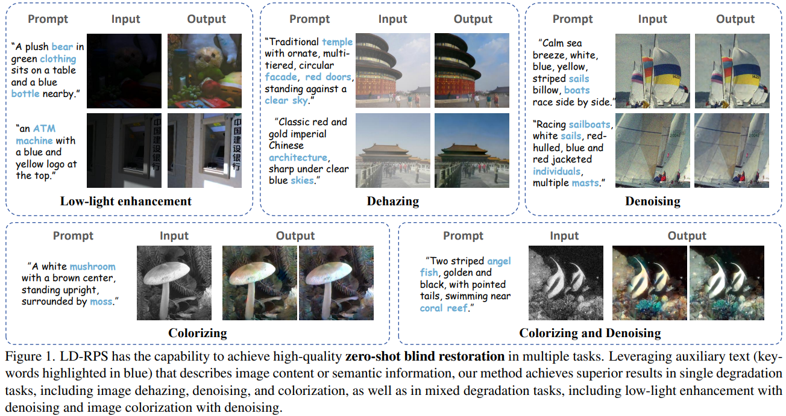

# LD-RPS: Zero-Shot Unified Image Restoration via Latent Diffusion Recurrent Posterior Sampling（ICCV2025）

[Paper](https://arxiv.org/abs/2507.00790)

#### News
- **June, 2025:**  Our work of unified image restoration and generation has been accepted to ICCV 2025!
- **July, 2025:**  Our inference code and all data has been opened in access!

> **Abstract:** *Unified image restoration is a significantly challenging task in low-level vision. Existing methods either make tailored designs for specific tasks, limiting their generalizability across various types of degradation, or rely on training with paired datasets, thereby suffering from closed-set constraints. To address these issues, we propose a novel, dataset-free, and unified approach through recurrent posterior sampling utilizing a pretrained latent diffusion model. Our method incorporates the multimodal understanding model to provide sematic priors for the generative model under a task-blind condition. Furthermore, it utilizes a lightweight module to align the degraded input with the generated preference of the diffusion model, and employs recurrent refinement for posterior sampling. Extensive experiments demonstrate that our method outperforms state-of-the-art methods, validating its effectiveness and robustness. *

  

---

## Installation

To create a new conda environment, run:

    conda create -n LDRPS python=3.10

To activate the environment and install packages:

    conda activate LDRPS
    pip install -r requirements.txt

We should install diffusers locally:

    cd diffusers
    pip install -e .

If you fail at this step, you can achieve it by using the command "conda install diffusers==0.31.0". Additionally, you need to copy the file "diffusers/src/diffusers/schedulers/scheduling_ddim.py" from the code directory and replace the corresponding file in the installation directory.

## Data Preparing

We release four datasets with the resolution 256*256. You can download them at [google drive](https://drive.google.com/drive/folders/18vB4KhYur4hyKPjQBormuxBymOOUNtm0?usp=drive_link).

## Running

You can run our code by instructions like these:

    python instruct_all_in_one/lowlight_pipeline.py --result_dir XX --sample_dir XX --text_dir XX
    python instruct_all_in_one/dehazing_pipeline.py --result_dir XX --sample_dir XX --text_dir XX
    python instruct_all_in_one/denoising_pipeline.py --result_dir XX --sample_dir XX --text_dir XX

We also prepare a fast version by using float16 diffusion. You can refer it by:

    python instruct_all_in_one/lowlight_pipeline_16fp.py --result_dir XX --sample_dir XX --text_dir XX

If you want to run in multiple GPU devices, you can run:

    sh multi_run.sh

## Evaluating

You can get quantitive scores by running:

    sh evaluation.sh

## Citation
If you use our project, please consider citing:

    @article{li2025LDRPS,
      title={LD-RPS: Zero-Shot Unified Image Restoration via Latent Diffusion Recurrent Posterior Sampling},
      author={Huaqiu Li and Yong Wang and Tongwen Huang and Hailang Huang and Haoqian Wang and Xiangxiang Chu},
      journal={ICCV},
      year={2025}
    }
